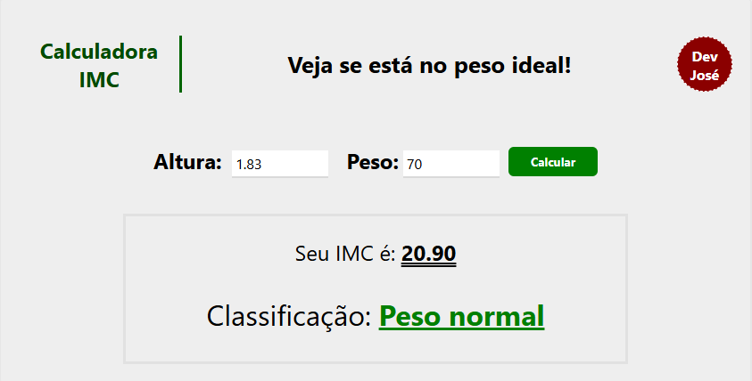

# 📊 Calcule seu IMC

Aplicação web responsiva desenvolvida com **React** e **CSS Modules** para calcular o Índice de Massa Corporal (IMC). A interface é simples, objetiva e adaptada para todos os tamanhos de tela.

## 🔗 Acesse o projeto

👉 [https://app-imc-saude.vercel.app/](https://app-imc-saude.vercel.app/)

---

## ✨ Funcionalidades

- ✅ Cálculo instantâneo do IMC com base em altura e peso
- ✅ Exibição da classificação do IMC:
  - Abaixo do peso
  - Peso normal
  - Sobrepeso
  - Obesidade Grau 1, 2 e 3
- ✅ Layout 100% responsivo (mobile-first)
- ✅ Cores e feedback visual conforme a faixa de IMC
- ✅ Estilização com **CSS Modules** para maior organização

---

## ⚙️ Tecnologias utilizadas

- [React](https://reactjs.org/)
- CSS Modules
- JavaScript (ES6+)
- [Vite](https://vitejs.dev/) <!-- Ou `Create React App`, se for o seu caso -->

---

## 🧪 Como rodar localmente

```bash
# Clone o repositório
git clone https://github.com/jose-junior1/calculadora-imc.git

# Acesse o diretório
cd calculadora-imc

# Instale as dependências
npm install

# Inicie o servidor de desenvolvimento
npm run dev
```

## 📷 Preview
<div align="center">
  
</div>

## 👨‍💻 Autor
Desenvolvido por José Junior


💼 GitHub - @jose-junior1
